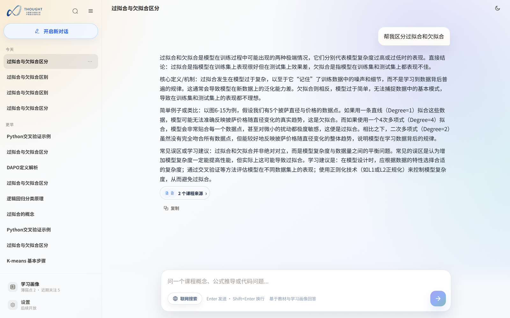
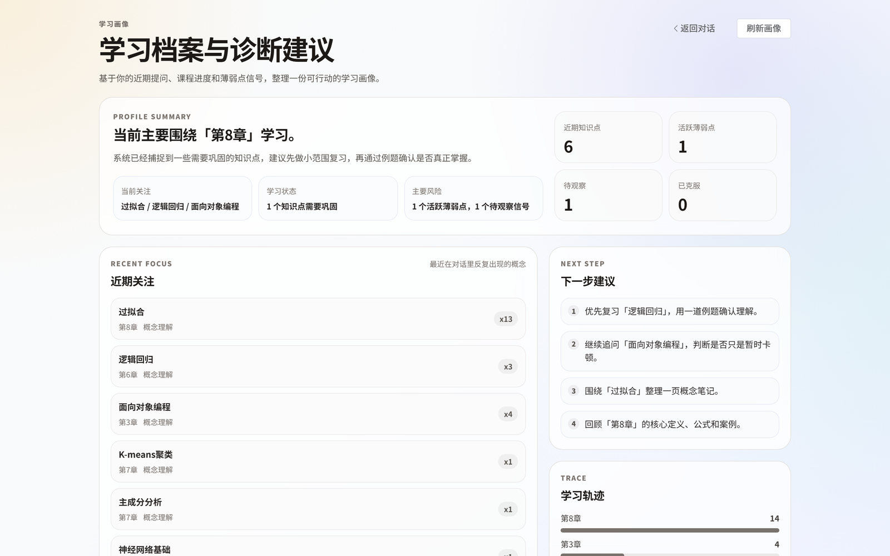
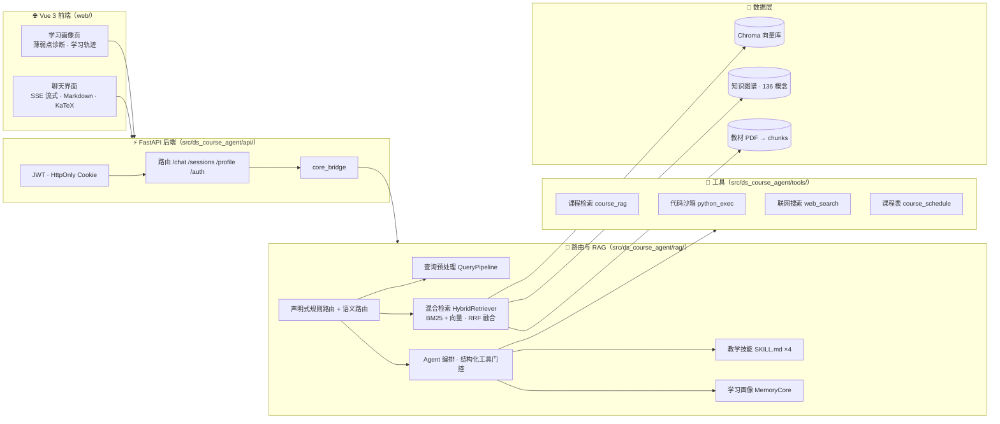

<div align="center">

# 📚 数据科学导论 RAG 课程助教

**把一本教材，变成一位懂你的助教。**

面向《数据科学导论》课程的 RAG 教学助手：将课程 PDF 构建为可检索知识库，用「混合检索 + 声明式路由 + 事件溯源学习画像 + SKILL.md 教学技能」，为每位学生提供 grounded 的课程问答、代码讲解、个性化学习路径与薄弱点追踪。


</div>

---

## ✨ 项目简介

> 学生不会问「检索哪一章」——他们会直接问「为什么过拟合」。这门课助教做的，就是把这些真实的提问，稳定地转成有教材依据、贴合个人进度的回答。

- **给谁用**：学习《数据科学导论》的学生（自学答疑、查漏补缺），以及课程助教与教师（内容问答、学情洞察）。
- **解决什么**：课程资料散落且量大，通用聊天机器人答得漂亮却不可信、不针对课程；本助教让每次回答**都有教材出处**，并记住**每个人**学到哪、哪里薄弱。
- **怎么做到**：教材 PDF → 一键构建可检索知识库；混合检索保证召回；声明式路由 + 语义路由把问题稳定分派到正确的回答机制；事件溯源式学习画像让回答因人而异；fail-closed 的沙箱与边界守卫让系统安全可用。

## 🎯 核心特性

### 📖 课程问答与检索

| 特性 | 说明 |
| --- | --- |
| 混合检索 | BM25 稀疏检索（jieba 中文分词）与 ChromaDB 向量语义检索经 **RRF 融合（k=60）** 取 top-N；向量服务不可用时自动降级 BM25-only |
| 引用溯源 | 回答内嵌 `[n]` 教材引用，换算为教材绝对页码，前端一键跳转对应来源 |
| 检索守卫 | `RetrievalGuard` 作为安全网：路由要求 grounded 却未检索时，强制补一次 RAG，避免模型凭印象作答课程事实题 |
| 分层降级 | Embedding 超时降级、回答模型失败降级为可核验的「教材片段模式」，检索与回答双层 LRU+TTL 缓存，弱网/本地依然可用 |
| 课程表查询 | 自然语言解析「今天有课吗」「第 N 周安排」，返回结构化课程表 |

### 🧭 智能路由与 Agent 编排

| 特性 | 说明 |
| --- | --- |
| 路由即数据 | 把 if/elif 分支收敛为「按优先级求值的声明式规则表 + 意图→执行策略的确定性映射」，每个路由决策只有单一事实源 |
| 语义路由兜底 | 规则未命中时由 LLM 分类器将问题归入 **13 类学习意图**，输出经 pydantic 严格校验，低置信度 fail-closed 为澄清回复；分类器只给意图、不给任何执行权限 |
| 查询预处理/重写 | 把原始输入归一化为类型化 QueryContext，识别知识点与澄清/掌握信号；保守改写只生成检索用的 enriched_query，零外部调用 |
| 课程边界守卫 | `ScopeGuard` 把「课程助教，而非通用搜索引擎」做成单一判定模块，隐私/学术诚信类请求表驱动拒绝 |

### 🧠 个性化学习与记忆

| 特性 | 说明 |
| --- | --- |
| 事件溯源画像 | 每轮对话自动采集学习事件（概念提及/澄清/掌握/误解），画像从 JSONL 事件流**幂等重建**，可审计、可回放、崩溃安全 |
| 三层画像模型 | 最近关注概念 + 待观察/活跃/已克服三类薄弱点 + 章节进度与统计，薄弱点带**证据链**与置信度（封顶 0.95） |
| 知识点映射 | 基于 **136 概念知识图谱**做「别名精确 → 正则规则 → Embedding 语义兜底」三层匹配，泛词误命中可控 |
| 画像注入对话 | 当前进度、薄弱点以自然语言注入每轮系统上下文，让讲解贴合个人进度 |

### 🎓 教学技能（SKILL.md 驱动）

| 技能 | 作用 |
| --- | --- |
| `learning-path` | 结合章节进度、薄弱点与知识图谱前置关系，生成「优先级 → 三步路线 → 30 分钟行动 → 自测清单」的个性化学习计划 |
| `personalized-explanation` | 用已学概念桥接新概念、只点破强相关薄弱点，生成严格基于教材的讲解 |
| `misconception-handling` | 三分类识别错误认知，温和或直接纠正并回写画像 |
| `code-review` | LLM 逐行静态审查学生代码，定位错误行号并给出修正；**评审路径绝不运行学生代码** |

技能以 `SKILL.md` 声明式加载（YAML frontmatter + 提示词 + executor），executor 优先、无 executor 回退提示词，总量收敛为 4 个，避免「万物皆 agent 原语」的膨胀。

### 🛡️ 安全与工程健壮性

| 特性 | 说明 |
| --- | --- |
| Docker 代码沙箱 | 仅在用户明确要求运行时执行，fail-closed：无网络、只读、非 root、cap-drop=ALL，内存/CPU/PID/超时四维限制；Docker 不可用**不降级**宿主机 |
| SSRF 防护 | 网页抓取 DNS+TCP 后对端 IP 校验（拒绝内网/链路本地等），逐跳重定向复验 |
| 联网搜索 | 前端显式开关触发，支持 Tavily / Serper / Brave / DuckDuckGo |
| 双模 LLM | 同一套代码兼容远程 OpenAI 兼容接口与本地 Ollama，四类错误分类 + 指数退避重试 |
| 断线续传 | SSE 流式对话支持停止生成、续写完成、断线 1s 自动重连与终态重放 |

### 🧪 评测与质量保障

- **检索对比评测**：同一 QA 集对比纯向量 / BM25 混合 / 混合+Rerank，输出 Recall@K、MRR、nDCG 等指标，用配对 t 检验与 Wilcoxon 判定提升显著性。
- **Agent 端到端评测**：30 个固定任务按六维度自动评分，快照模型与提示词 SHA256 保证可复现。
- **离线路由边界验证**：stub 掉 LLM/检索/工具，用 **119 个边界案例**确定性校验路由契约，`unexpected_rag_count == 0` 是 CI 硬门槛。
- **431 个测试** 与 ruff 风格门槛（line-length=120）构成本地可复现的 CI 质量关口；知识库构建即输出 0-100 质量评分。

---

## 📸 界面预览

<div align="center">
  <table>
    <tr>
      <td width="50%">
        
        <p><em>基于教材的流式问答 · 引用溯源</em></p>
      </td>
      <td width="50%">
        
        <p><em>个性化学习画像 · 薄弱点诊断</em></p>
      </td>
    </tr>
  </table>
</div>

---

## 🏗️ 系统架构



**一次提问的旅程**：

1. `web/` 通过 HTTP/SSE 把问题发给 FastAPI；
2. `api/` 校验登录（JWT Cookie），经 `core_bridge` 进入 `rag` 层；
3. 查询流水线做预处理与边界守卫，再由**规则表 + 语义路由**决定回答机制；
4. 按需执行混合检索 / 教学技能 / 工具调用，学习事件实时回写画像；
5. 结果标准化为「正文 + 引用来源 + trace」，SSE 流式返回前端。

架构边界与能力模型见 [`docs/architecture_reorg_plan.md`](docs/architecture_reorg_plan.md) 与 [`docs/capability_model.md`](docs/capability_model.md)。

---

## 🚀 快速开始

### 环境要求

- Python 3.10+
- Node.js 18+
- 一个 Embedding 服务端（如 SiliconFlow，或本地模型）
- 一个 Chat 模型服务端（远程 OpenAI 兼容接口，或本地 Ollama）

### 1. 配置环境变量

```bash
cp .env.example .env
```

在 `.env` 中填入模型密钥与模型名（默认已配好 SiliconFlow 的 Embedding 与 Qwen 模型）。

### 2. 安装依赖

```bash
pip install -r config/api-requirements.txt   # 后端
cd web && npm install                        # 前端
```

### 3. 构建知识库

把课程资料放入 `data/`，一条命令构建：

```bash
python main.py build data/
```

构建完成后即输出知识库 **0-100 质量评分**。

### 4. 启动服务

```bash
python main.py api --reload   # 后端（默认 127.0.0.1:8084）

cd web && npm run dev         # 前端（Vite 开发服务器）
```

### 5. 验证

```bash
curl http://127.0.0.1:8084/health
```

先创建一个登录账号（用户名 / 密码 / 学号 / 显示名）：

```bash
python scripts/create_user.py alice 'secret-password' student_001 'Alice'
```

然后浏览器打开 **http://127.0.0.1:5185**，登录后开始提问。

---

## 🛠️ 常用命令

```bash
python main.py help                       # 查看全部命令
python main.py build data/                # 构建知识库
python main.py eval                       # 运行检索评测
python main.py test                       # 运行测试
python main.py api --reload               # 启动后端
python -m pytest -q                       # 全量测试
python scripts/ci_quality_gate.py --skip-full   # 本地 CI 质量门槛
cd web && npm run build                   # 构建前端
docker compose -f deploy/compose.yaml up --build   # Docker 一键部署
```

---

## 📂 项目结构

```text
src/ds_course_agent/
├── api/                  FastAPI 应用：路由、认证、schema、SSE 流式桥
├── rag/                   Agent 编排、混合检索、查询流水线、语义路由、学习画像
│   └── query_pipeline/    路由即数据：规则表 / 语义路由 / 重写 / 策略 / 后处理
├── kb/                    PDF 解析 → 清洗 → 目录解析 → 分块 → 向量化入库
├── teaching/skills/       SKILL.md 教学技能（学习路径/个性化讲解/误解处理/代码评审）
├── tools/                 课程检索、课程表、代码沙箱、联网搜索、网页抓取等 8 个工具
├── hooks/                 检索守卫、学习事件、澄清检测等横切钩子
└── shared/                配置、路径、日志、历史、上下文治理、向量库封装

web/                       Vue 3 前端（聊天 / 画像 / 登录）
benchmarks/                检索评测、Agent 评测、路由边界验证
tests/                     单元与集成测试（含 tests/integration/api/）
data/                      课程元数据（知识图谱、课表、目录 JSON）
deploy/                    Docker / Compose 部署文件
docs/                      架构、能力模型、沙箱等设计文档
var/                       本地运行时状态（chat_history、chroma_db、logs…，不入库）
```

---

## ⚙️ 配置与部署

### 关键配置（`.env`）

<details>
<summary>展开查看主要配置项</summary>

| 配置 | 默认值 | 说明 |
| --- | --- | --- |
| `EMBEDDING_MODEL` | `Qwen/Qwen3-Embedding-8B` | Embedding 模型 |
| `REMOTE_MODEL_NAME` | `Qwen/Qwen3-8B` | Chat 模型（`USE_REMOTE_LLM=false` 时用本地 Ollama） |
| `AUTH_SESSION_TTL_HOURS` | `12` | 登录会话有效期 |
| `CHUNK_SIZE` / `CHUNK_OVERLAP` | `1300` / `300` | 知识库分块参数 |
| `ENABLE_RERANK` | `false` | 是否开启 CrossEncoder 重排序 |
| `WEB_SEARCH_ENABLED` | `false` | 是否开启联网搜索（前端另有显式开关） |
| `PYTHON_EXEC_BACKEND` | `docker` | 代码沙箱后端（fail-closed） |
| `RAG_ANSWER_MAX_TOKENS` | `768` | 回答最大 token |

完整配置见 [`.env.example`](.env.example)。
</details>

### Docker 部署

```bash
docker compose -f deploy/compose.yaml config   # 校验配置
docker compose -f deploy/compose.yaml up --build
```

- Compose 提供 **backend**（`0.0.0.0:8000`，`/health` healthcheck）与 **frontend**（nginx 80）两个服务；
- 生产密钥与浏览器来源通过环境变量注入（`AUTH_SECRET_KEY`、`CORS_ALLOW_ORIGINS` 等），`api.Dockerfile` 不把 `.env` 打进镜像。

---

## 🧪 测试

```bash
python -m pytest -q                  # 全量 431 个测试
python scripts/ci_quality_gate.py    # CI 质量门槛（ruff + 定向测试 + 路由边界）
```

API 集成测试位于 `tests/integration/api/`。

---

## 🤝 贡献

欢迎以 issue / PR 参与。改动前请先阅读 [`AGENTS.md`](AGENTS.md)（工程宪法：反屎山三铁律、统一风格、验证门槛、变更纪律），并遵守其自检清单。

- 分支命名：`feat|fix|refactor/<topic>`，提交遵循 Conventional Commits；
- 提交前本地必须通过 ruff 与 `python -m pytest -q`；
- 契约类改动必须配套不变量测试。

## 📄 License

[MIT](LICENSE)
