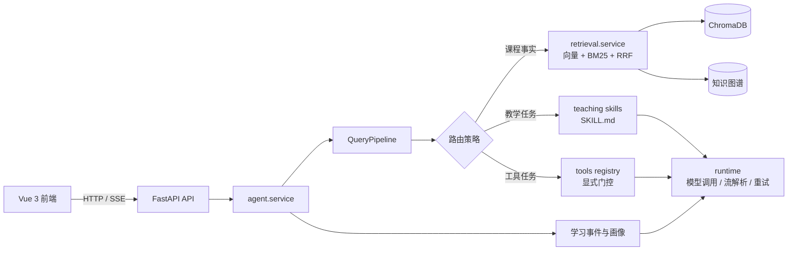
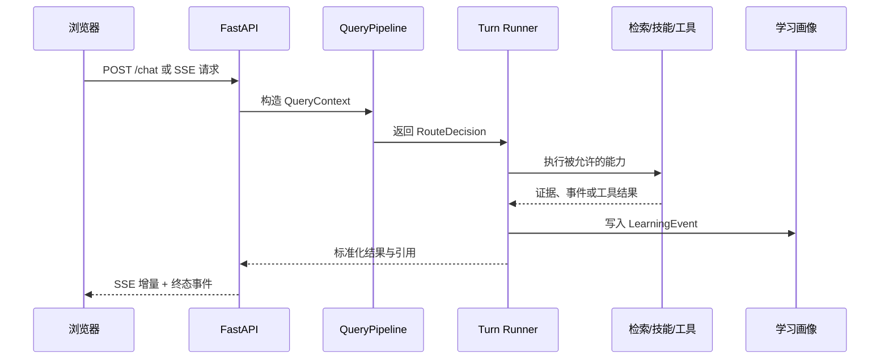

# 数据科学导论 · RAG 课程助教

<div align="center">

面向课程学习的检索增强教学助手：回答有教材依据，讲解结合学习进度，并把互动沉淀为可追踪的学习事件。


</div>

---

## 项目定位

学生可以直接问“为什么会过拟合”“这段 Python 哪里错了”或“我现在该复习什么”。系统会先识别问题意图和课程边界，再选择检索、教学技能、评测或工具路径；回答携带教材来源，学习画像通过事件流持续更新。

它适合学生自学答疑与查漏补缺，也适合教师和助教查看课程内容、学习进度与薄弱点。课程 PDF、知识图谱和课表都是可替换的数据输入，运行时状态统一写入 `var/`。

## 能力一览

| 能力 | 当前行为 |
| --- | --- |
| 课程 RAG | ChromaDB 向量检索与 BM25 词法检索组合，支持 RRF 和可选重排序；上下文按 token 预算裁剪，并保留页码与来源片段。 |
| 稳定路由 | `QueryPipeline` 负责预处理、范围判断、规则路由、语义兜底和检索查询改写。 |
| 教学个性化 | 学习事件以 JSONL 记录，画像可幂等重建；知识图谱用于概念映射、前置关系和学习路径建议。 |
| 教学技能 | `learning-path`、`personalized-explanation`、`misconception-handling`、`code-review` 由 `SKILL.md` 声明并按需执行。代码评审不会运行学生代码。 |
| 课程工具 | 课程检索、课程表、知识库状态、日期时间、联网搜索/抓取、Python 代码执行与练习评测。 |
| 实时交互 | Vue 3 + Pinia 通过 HTTP/SSE 调用 FastAPI，支持流式回答、停止生成、断线重连和引用展示。 |
| 安全边界 | 代码执行默认使用 Docker 沙箱（无网络、只读、非 root、资源限制）；联网抓取校验目标并逐跳防 SSRF。 |

## 界面预览

<div align="center">
  <table>
    <tr>
      <td width="50%"></td>
      <td width="50%"></td>
    </tr>
    <tr>
      <td align="center"><sub>流式课程问答 · 引用溯源</sub></td>
      <td align="center"><sub>学习画像 · 薄弱点追踪</sub></td>
    </tr>
  </table>
</div>

## 系统架构



一次提问的生命周期：



## 快速开始

### 环境

- Python 3.10+
- Node.js 18+
- 一个 Embedding 服务和一个 Chat 模型服务（远程 OpenAI 兼容接口或本地 Ollama）
- 需要执行代码时安装 Docker

### 安装与配置

```bash
cp .env.example .env
pip install -r config/api-requirements.txt
cd web && npm install && cd ..
```

在 `.env` 中填写模型服务地址、模型名和密钥。联网搜索默认关闭；生产环境请设置 `AUTH_SECRET_KEY` 与 `CORS_ALLOW_ORIGINS`。

### 构建知识库

将课程 PDF 放入 `data/`（或传入其他目录）：

```bash
python main.py build data/
```

构建产物写入 `var/chroma_db`。离线构建还需要：

```bash
pip install -r config/kb-marker-requirements.txt
```

### 启动服务

```bash
python main.py api --reload       # 后端，默认 127.0.0.1:8084
cd web && npm run dev             # 前端，默认 127.0.0.1:5185
```

```bash
curl http://127.0.0.1:8084/health
python scripts/create_user.py alice 'secret-password' student_001 'Alice'
```

然后访问 <http://127.0.0.1:5185>。

## 常用命令

```bash
python main.py help
python main.py build data/
python main.py eval
python main.py test
python -m pytest -q
python scripts/ci_quality_gate.py --skip-full
cd web && npm run build
docker compose -f deploy/compose.yaml up --build
```

Docker Compose 启动 backend（8000）和 nginx frontend（80），生产密钥通过环境变量注入。

## 目录结构

```text
src/ds_course_agent/
├── api/          HTTP、认证、SSE 和请求响应适配
├── agent/        turn 编排、路由执行、生命周期事件与结果收尾
├── runtime/      模型调用、重试、流解析和消息转换
├── retrieval/    课程检索、排序与上下文组装
├── research/     联网研究、网页获取与证据策略
├── teaching/     学习状态、知识图谱、事件与 SKILL.md
├── assessment/   练习生成、提交验证与反馈
├── tools/        原子工具、注册和执行隔离
├── kb/           离线 PDF 清洗、分块与入库
└── shared/       配置、路径、日志、历史和基础设施
web/              Vue 3 前端
benchmarks/       检索、路由和端到端评测
tests/            单元与集成测试
data/             课程元数据、课表和知识图谱
deploy/           Docker / Compose 部署文件
var/              本地运行时状态（不入库）
```

## 配置参考

常用变量包括 `EMBEDDING_MODEL`、`REMOTE_MODEL_NAME`、`RAG_CANDIDATE_DEPTH`、`RAG_CONTEXT_MAX_TOKENS`、`WEB_SEARCH_ENABLED`、`PYTHON_EXEC_BACKEND` 和 `AUTH_SESSION_TTL_HOURS`。默认值与完整说明见 [`.env.example`](.env.example)。

## 质量与贡献

提交前运行与改动范围匹配的测试；跨模块改动至少执行：

```bash
ruff check src tests scripts benchmarks
ruff format --check src tests scripts benchmarks
python -m pytest -q
```

路由或检索改动还应运行 `tests/test_query_pipeline.py`、`tests/test_route_harness.py` 与 `python benchmarks/route_harness.py`，确保 `unexpected_rag_count == 0`。贡献前请阅读 [`AGENTS.md`](AGENTS.md)，分支使用 `feat|fix|refactor/<topic>`，提交遵循 Conventional Commits。

## 许可

本项目采用 [MIT License](LICENSE)。
